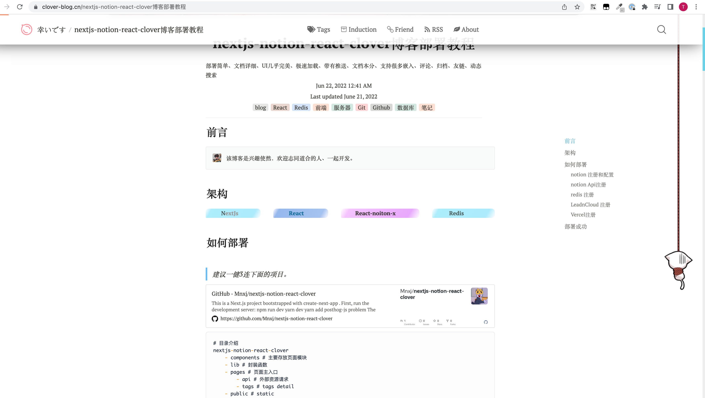
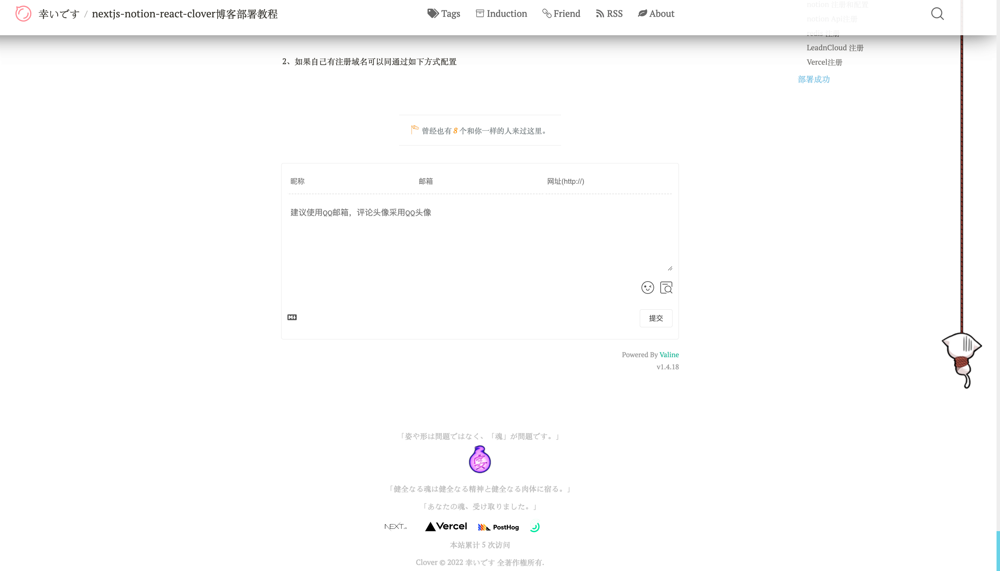
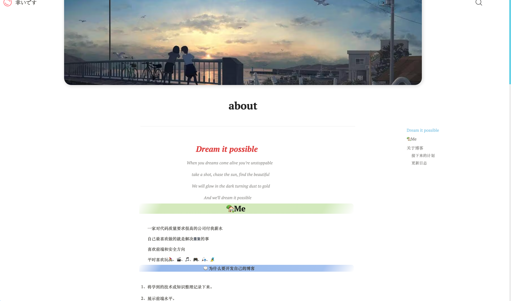
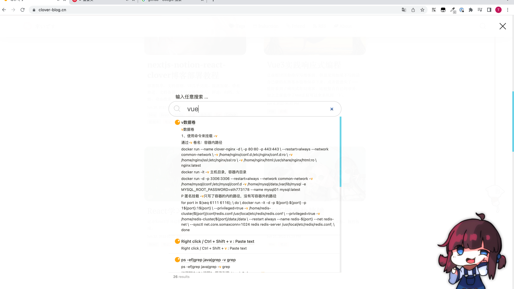
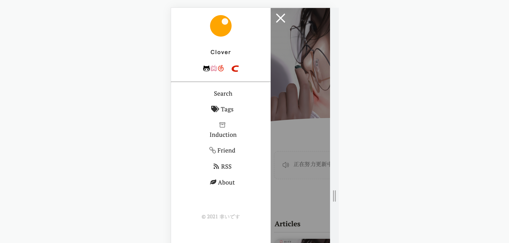

This is a [Next.js](https://nextjs.org/) project bootstrapped with [`create-next-app`](https://github.com/vercel/next.js/tree/canary/packages/create-next-app).

# nextjs-notion-react-clover

Install [Docs](https://clover-blog.cn/nextjs-notion-react-clover%E5%8D%9A%E5%AE%A2%E9%83%A8%E7%BD%B2%E6%95%99%E7%A8%8B)

[Demo](https://clover-blog.cn/) 

# Directory
nextjs-notion-react-clover
	- components # 主要存放页面模块
	- lib # 封装函数
	- pages # 页面主入口
		- api # 外部资源请求
		- tags # tags detail
	- public # static
		- images 
		- media 
	- styles 
	- .env.example # key config
	- .vercelignore # vercel config
	- next.config.js # nextjs config
	- site.config.ts # global variable config

# local start
Foreword: [You need to prepare the key required for the .env file.](https://www.notion.so/nextjs-notion-react-clover-2f0f3d3248534cc1ae4ea20006ca6c71) 
1、node 18.20.2+
2、npm install -g yarn
3、yarn install
4、yarn dev

# show

# build problem

1、图片资源太大
引入`.vercelignore`加入api的过滤
2、加入`.vercelignore`过滤会过滤掉缓存的页面
需要对api下面加一层，单独对图片目录过滤
3、<components.Link 使用url会跳转到新的页面
因为转为a标签带有`target="_blank"` 改为`target=""·`

